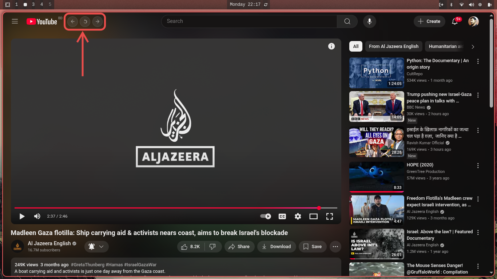

# Omarchy PWA Nav Buttons Extension

A lightweight Chrome/Chromium extension built specifically for **Omarchy OS Web Apps (PWAs)**.  
In Omarchy PWAs, the built-in navigation (Back, Forward, Reload) is often unavailable.  
This extension adds a floating toolbar with **Back**, **Reload**, and **Forward** buttons so you can easily navigate inside any installed PWA.

---

## ✨ Features
- ⬅️ **Back**: Navigate to the previous page  
- 🔄 **Reload**: Refresh the current PWA window  
- ➡️ **Forward**: Navigate to the next page  
- 🌀 **Loading Indicator**: Visual feedback with a colorful spinning animation around the reload button during page loads
- 🖱️ **Draggable toolbar** – move it anywhere inside the PWA  
- 💾 **Site-specific position memory** – each PWA remembers its toolbar position (stored in `localStorage`)  
- 🎯 **Smart Navigation Detection**: Automatically detects link clicks, back/forward navigation, and form submissions
- 📱 **SPA Support**: Works seamlessly with both traditional websites and Single Page Applications (SPAs)
- Simple, modern design with hover effects  

---

## 📸 Screenshot

---

## 📂 Installation
1. Download or clone this repository.  
2. Open **Chrome/Chromium** and go to: `chrome://extensions/`  
3. Enable **Developer Mode** (toggle in top-right).  
4. Click **Load unpacked** and select the extension folder.  
5. Open your **Omarchy PWA app** → the toolbar will appear in the top-left corner.  

---

## 🚀 Usage
- Click **⬅️ Back** to go to the previous page.  
- Click **🔄 Reload** to refresh the current page.  
- Click **➡️ Forward** to go forward in history.  
- Watch the **colorful loading animation** spin around the reload button while pages load.
- Drag the toolbar anywhere on the screen.  
- The toolbar will **remember its position per app/site**.  

---

## 🎨 Loading States
The extension automatically shows a loading indicator when:
- 🔗 Clicking any internal link
- ⬅️➡️ Using back/forward buttons (toolbar or browser)
- 🔄 Reloading the page
- 📝 Submitting forms
- 🔀 SPA route changes (using History API)

The colorful spinning circle provides instant visual feedback that navigation is in progress!

---

## 📜 License
MIT License – free to use and modify.