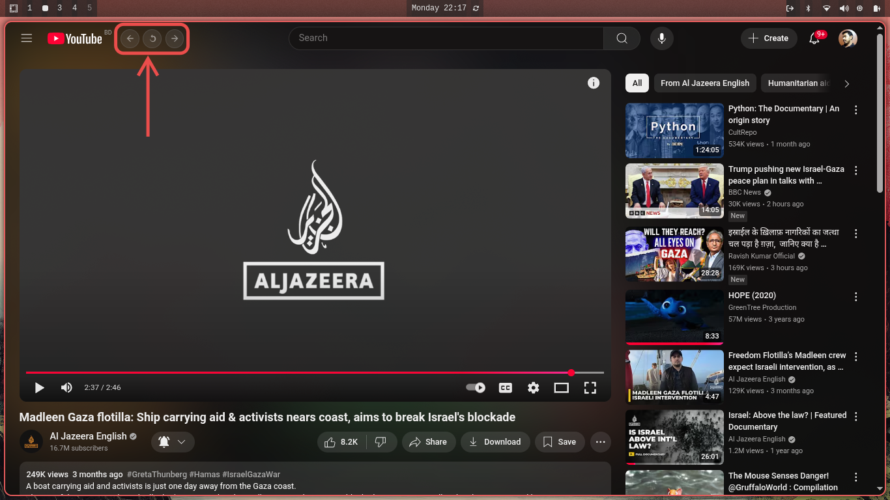

# YouTube Nav Buttons Extension

A lightweight Chrome/Chromium extension that adds **Back**, **Reload**, and **Forward** buttons directly inside the YouTube PWA interface.  
The buttons appear next to the YouTube logo in the top-left corner, styled with modern material-style icons.

---

## ✨ Features
- ⬅️ Back: Navigate to the previous page  
- 🔄 Reload: Refresh the current page  
- ➡️ Forward: Navigate to the next page  
- Modern round button design with hover effects  
- Works seamlessly inside YouTube web app (PWA) or in the browser  

---

## 📸 Screenshot

---

## 📂 Installation
1. Download or clone this repository.  
2. Open **Chrome/Chromium** and go to:  `chrome://extensions/`
3. Enable **Developer Mode** (toggle in top-right).  
4. Click **Load unpacked** and select the extension folder.  
5. Open YouTube → You’ll see the navigation buttons next to the logo.

---

## 📂 Folder Structure
youtube-nav-extension/
├── manifest.json # Extension manifest
├── buttons.js # Injects the toolbar with buttons
├── buttons.css # Styling for buttons
└── Navigation-YouTube-PWA.png # Screenshot

---

## 🚀 Usage
- Click **⬅️ Back** to go to the previous page.  
- Click **🔄 Reload** to refresh the page.  
- Click **➡️ Forward** to go forward in history.  

---

## 📜 License
MIT License – free to use and modify.
